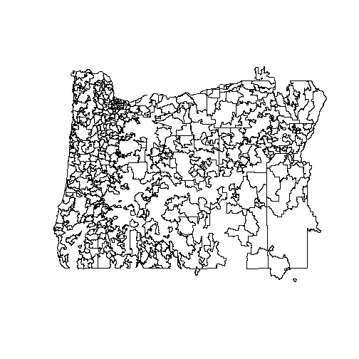
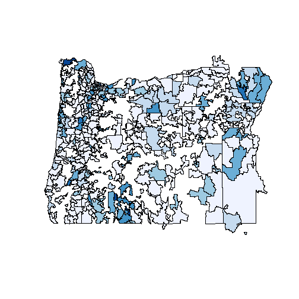

Using `maptools`
========================================================

Download TIGER 2012 shapefiles [here](http://www.census.gov/geo/maps-data/data/tiger-line.html). Store the shapefiles on the CHSE server in the `DataRepository/Shapefiles/TIGER 2012` folder. 

Resources:
* [Combining Spatial Data](http://cran.r-project.org/web/packages/maptools/vignettes/combine_maptools.pdf)
* [Maps in R -- Examples](http://geography.uoregon.edu/geogr/topics/maps.htm)
* [adding variable to shapefile](http://r-sig-geo.2731867.n2.nabble.com/adding-variable-to-shapefile-td6193408.html)

Load `maptools`

```r
require(maptools)
```

```
## Loading required package: maptools
```

```
## Warning: package 'maptools' was built under R version 3.0.1
```

```
## Loading required package: foreign
```

```
## Loading required package: sp
```

```
## Warning: package 'sp' was built under R version 3.0.1
```

```
## Loading required package: grid
```

```
## Loading required package: lattice
```

```
## Checking rgeos availability: FALSE Note: when rgeos is not available,
## polygon geometry computations in maptools depend on gpclib, which has a
## restricted licence. It is disabled by default; to enable gpclib, type
## gpclibPermit()
```

```r
require(RColorBrewer)
```

```
## Loading required package: RColorBrewer
```

```r
library(classInt)
```

```
## Warning: package 'classInt' was built under R version 3.0.1
```

```
## Loading required package: class
```

```
## Loading required package: e1071
```

```
## Warning: package 'e1071' was built under R version 3.0.1
```


Read in the TIGER Zip Code Tabulation Area (ZCTA) shapefile. I'm not sure why the `proj4string` parameter works, but it fixes the projection.

```r
dir <- "E:/DataRepository/Shapefiles/TIGER 2012/tl_2012_us_zcta510"
file <- paste(dir, "tl_2012_us_zcta510.shp", sep = "/")
# mapCountyUS <- readShapeLines(shpfile, proj4string=CRS('+proj=longlat'))
shpUS <- readShapePoly(file, proj4string = CRS("+proj=longlat"))
summary(shpUS)
```

```
## Object of class SpatialPolygonsDataFrame
## Coordinates:
##       min    max
## x -176.68 145.83
## y  -14.37  71.34
## Is projected: FALSE 
## proj4string : [+proj=longlat]
## Data attributes:
##    ZCTA5CE10        GEOID10      CLASSFP10   MTFCC10      FUNCSTAT10
##  00601  :    1   00601  :    1   B5:33144   G6350:33144   S:33144   
##  00602  :    1   00602  :    1                                      
##  00603  :    1   00603  :    1                                      
##  00606  :    1   00606  :    1                                      
##  00610  :    1   00610  :    1                                      
##  00612  :    1   00612  :    1                                      
##  (Other):33138   (Other):33138                                      
##     ALAND10            AWATER10              INTPTLAT10   
##  Min.   :5.09e+03   Min.   :0.00e+00   +37.3767764:    2  
##  1st Qu.:2.34e+07   1st Qu.:5.71e+04   +39.0662903:    2  
##  Median :9.28e+07   Median :5.77e+05   +40.9085841:    2  
##  Mean   :2.24e+08   Mean   :5.11e+06   -14.3193757:    1  
##  3rd Qu.:2.29e+08   3rd Qu.:2.76e+06   +13.2603724:    1  
##  Max.   :3.48e+10   Max.   :2.48e+09   +13.2949195:    1  
##                                        (Other)    :33135  
##         INTPTLON10   
##  -064.6829328:    1  
##  -064.6865698:    1  
##  -064.7365331:    1  
##  -064.7459318:    1  
##  -064.7500995:    1  
##  -064.7707382:    1  
##  (Other)     :33138
```


Since ZCTAs do not exactly correspond to geographical units, we need to read in a ZCTA relationship file that links ZCTAs to counties. 

```r
dir <- "E:/DataRepository/Shapefiles/TIGER 2012/ZCTA Relationship Files"
file <- paste(dir, "zcta_county_rel_10.txt", sep = "/")
zctarel <- read.table(file, header = TRUE, sep = ",")
head(zctarel)
```

```
##   ZCTA5 STATE COUNTY GEOID POPPT  HUPT    AREAPT AREALANDPT  ZPOP   ZHU
## 1   601    72      1 72001 18465  7695 165132671  164333375 18570  7744
## 2   601    72    141 72141   105    49   2326414    2326414 18570  7744
## 3   602    72      3 72003 41520 18073  83734431   79288158 41520 18073
## 4   603    72      5 72005 54689 25653  82063867   81880442 54689 25653
## 5   606    72     93 72093  6276  2740  94864349   94851862  6615  2877
## 6   606    72    121 72121    89    38   6679806    6679806  6615  2877
##       ZAREA ZAREALAND COPOP  COHU    COAREA COAREALAND ZPOPPCT ZHUPCT
## 1 167459085 166659789 19483  8125 173777444  172725651   99.43  99.37
## 2 167459085 166659789 33149 14192 298027589  294039825    0.57   0.63
## 3  83734431  79288158 41959 18258 117948080   79904246  100.00 100.00
## 4  82063867  81880442 60949 28430 195741178   94608641  100.00 100.00
## 5 109592548 109580061  6276  2740  94864349   94851862   94.88  95.24
## 6 109592548 109580061 25265 10958  92831653   92806330    1.35   1.32
##   ZAREAPCT ZAREALANDPCT COPOPPCT COHUPCT COAREAPCT COAREALANDPCT
## 1    98.61        98.60    94.77   94.71     95.03         95.14
## 2     1.39         1.40     0.32    0.35      0.78          0.79
## 3   100.00       100.00    98.95   98.99     70.99         99.23
## 4   100.00       100.00    89.73   90.23     41.92         86.55
## 5    86.56        86.56   100.00  100.00    100.00        100.00
## 6     6.10         6.10     0.35    0.35      7.20          7.20
```

Then subset the ZCTA relationship file for Oregon (state = 41). Also, create a character vector of Oregon ZCTAs and add it to the ZCTA relationship data frame.

```r
zctarelOR <- subset(zctarel, STATE == 41)
ZCTA5CHR <- sprintf("%05d", zctarelOR$ZCTA5)
zctarelOR <- data.frame(ZCTA5CHR, zctarelOR)
head(zctarelOR)
```

```
##       ZCTA5CHR ZCTA5 STATE COUNTY GEOID POPPT  HUPT    AREAPT AREALANDPT
## 40865    89421 89421    41     45 41045    93    57 1.430e+09  1.430e+09
## 42959    97001 97001    41     65 41065   229    76 7.710e+08  7.703e+08
## 42960    97002 97002    41      5 41005  1334   516 3.377e+07  3.291e+07
## 42961    97002 97002    41     47 41047  4289  1714 7.847e+07  7.784e+07
## 42962    97004 97004    41      5 41005  4388  1689 1.135e+08  1.134e+08
## 42963    97005 97005    41     67 41067 24906 10955 1.375e+07  1.375e+07
##        ZPOP   ZHU     ZAREA ZAREALAND  COPOP   COHU    COAREA COAREALAND
## 40865   634   306 2.165e+09 2.165e+09  31313  11692 2.572e+10  2.561e+10
## 42959   229    76 7.710e+08 7.703e+08  25213  11487 6.204e+09  6.168e+09
## 42960  5623  2230 1.122e+08 1.108e+08 375992 156945 4.876e+09  4.844e+09
## 42961  5623  2230 1.122e+08 1.108e+08 315335 120948 3.089e+09  3.062e+09
## 42962  4388  1689 1.135e+08 1.134e+08 375992 156945 4.876e+09  4.844e+09
## 42963 24906 10955 1.375e+07 1.375e+07 529710 212450 1.881e+09  1.876e+09
##       ZPOPPCT ZHUPCT ZAREAPCT ZAREALANDPCT COPOPPCT COHUPCT COAREAPCT
## 40865   14.67  18.63    66.07        66.07     0.30    0.49      5.56
## 42959  100.00 100.00   100.00       100.00     0.91    0.66     12.43
## 42960   23.72  23.14    30.09        29.72     0.35    0.33      0.69
## 42961   76.28  76.86    69.91        70.28     1.36    1.42      2.54
## 42962  100.00 100.00   100.00       100.00     1.17    1.08      2.33
## 42963  100.00 100.00   100.00       100.00     4.70    5.16      0.73
##       COAREALANDPCT
## 40865          5.58
## 42959         12.49
## 42960          0.68
## 42961          2.54
## 42962          2.34
## 42963          0.73
```


Subset the TIGER shapefile to include only the Oregon ZCTAs.

```r
shpOR <- subset(shpUS, ZCTA5CE10 %in% zctarelOR$ZCTA5)
summary(shpOR)
```

```
## Object of class SpatialPolygonsDataFrame
## Coordinates:
##       min     max
## x -124.57 -116.46
## y   41.71   46.29
## Is projected: FALSE 
## proj4string : [+proj=longlat]
## Data attributes:
##    ZCTA5CE10      GEOID10    CLASSFP10  MTFCC10    FUNCSTAT10
##  89421  :  1   89421  :  1   B5:419    G6350:419   S:419     
##  97001  :  1   97001  :  1                                   
##  97002  :  1   97002  :  1                                   
##  97004  :  1   97004  :  1                                   
##  97005  :  1   97005  :  1                                   
##  97006  :  1   97006  :  1                                   
##  (Other):413   (Other):413                                   
##     ALAND10            AWATER10              INTPTLAT10 
##  Min.   :1.88e+04   Min.   :0.00e+00   +41.9299921:  1  
##  1st Qu.:6.10e+07   1st Qu.:5.38e+04   +42.0341396:  1  
##  Median :1.81e+08   Median :5.50e+05   +42.0364865:  1  
##  Mean   :3.99e+08   Mean   :5.28e+06   +42.0520986:  1  
##  3rd Qu.:4.22e+08   3rd Qu.:3.52e+06   +42.0843863:  1  
##  Max.   :1.34e+10   Max.   :1.98e+08   +42.1189763:  1  
##                                        (Other)    :413  
##         INTPTLON10 
##  -116.7369842:  1  
##  -116.9184440:  1  
##  -117.0395862:  1  
##  -117.0841615:  1  
##  -117.1072752:  1  
##  -117.1612358:  1  
##  (Other)     :413
```


Merge the attributes from the ZCTA relationship file to the Oregon shapefile. Some ZCTAs span across counties. So we'll exclude the attributes that are county-specific; e.g., 2010 Population of the 2010 County (`COPOP`) and Total Area of the 2010 County (`COAREA`). The record file layout can be found [here](http://www.census.gov/geo/maps-data/data/zcta_rel_layout.html).

```r
d1 <- shpOR@data
d2 <- subset(zctarelOR, select = c(ZCTA5CHR, ZCTA5, STATE, ZPOP, ZHU, ZAREA, 
    ZAREALAND))
d <- merge(d1, d2, by.x = "ZCTA5CE10", by.y = "ZCTA5")
shpOR@data <- d
summary(shpOR)
```

```
## Object of class SpatialPolygonsDataFrame
## Coordinates:
##       min     max
## x -124.57 -116.46
## y   41.71   46.29
## Is projected: FALSE 
## proj4string : [+proj=longlat]
## Data attributes:
##    ZCTA5CE10      GEOID10    CLASSFP10  MTFCC10    FUNCSTAT10
##  97035  :  3   97035  :  3   B5:513    G6350:513   S:513     
##  97056  :  3   97056  :  3                                   
##  97132  :  3   97132  :  3                                   
##  97140  :  3   97140  :  3                                   
##  97231  :  3   97231  :  3                                   
##  97324  :  3   97324  :  3                                   
##  (Other):495   (Other):495                                   
##     ALAND10            AWATER10              INTPTLAT10 
##  Min.   :1.88e+04   Min.   :0.00e+00   +44.3650250:  3  
##  1st Qu.:6.66e+07   1st Qu.:5.81e+04   +44.3762051:  3  
##  Median :1.84e+08   Median :5.71e+05   +44.4987537:  3  
##  Mean   :3.99e+08   Mean   :5.14e+06   +45.0771135:  3  
##  3rd Qu.:4.23e+08   3rd Qu.:3.48e+06   +45.3242190:  3  
##  Max.   :1.34e+10   Max.   :1.98e+08   +45.3531038:  3  
##                                        (Other)    :495  
##         INTPTLON10     ZCTA5CHR       STATE         ZPOP      
##  -121.2435868:  3   97035  :  3   Min.   :41   Min.   :    0  
##  -121.9001215:  3   97056  :  3   1st Qu.:41   1st Qu.:  714  
##  -122.7251706:  3   97132  :  3   Median :41   Median : 2985  
##  -122.8242089:  3   97140  :  3   Mean   :41   Mean   : 9775  
##  -122.8659138:  3   97231  :  3   3rd Qu.:41   3rd Qu.:14096  
##  -122.9694079:  3   97324  :  3   Max.   :41   Max.   :66954  
##  (Other)     :495   (Other):495                               
##       ZHU            ZAREA            ZAREALAND       
##  Min.   :    0   Min.   :1.88e+04   Min.   :1.88e+04  
##  1st Qu.:  407   1st Qu.:7.11e+07   1st Qu.:6.66e+07  
##  Median : 1354   Median :1.96e+08   Median :1.84e+08  
##  Mean   : 4262   Mean   :4.04e+08   Mean   :3.99e+08  
##  3rd Qu.: 6495   3rd Qu.:4.26e+08   3rd Qu.:4.23e+08  
##  Max.   :27682   Max.   :1.35e+10   Max.   :1.34e+10  
## 
```


Plot the Oregon ZCTAs.

```r
plot(shpOR)
```

 

There's some weirdness with 1 Washington ZCTA and some California ZCTAs being plotted. **Will need to resolve**

Color code by ZCTA population size.

```r
x <- shpOR@data$ZPOP
ncolors <- 7
pal <- brewer.pal(ncolors, "Blues")
# pal <- pal[ncolors:1] # reverse the palette
class <- classIntervals(x, ncolors, style = "equal")
colcode <- findColours(class, pal)
plot(shpOR, col = colcode)
```

 

